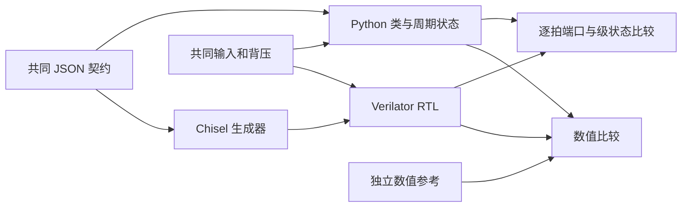

# 模拟器与 Chisel 结构

这一章描述算术内核、周期状态和组合连接。功能运算与控制状态分离；模拟器在输入握手时求值，随后通过与硬件相同的级容量及推进规则传输结果。



## Python 数值与加速

`ArithmeticUnit` 统一计算、批量、观察、提交、复位、清空和能力查询。`FloatingPointUnit`、`IntegerUnit` 分别实现数值行为。浮点生产内核只使用整数：解码得到整数有效数和二进制指数，加法与 FMA 精确对齐，乘法保留完整乘积，除法以整数商余决定舍入。

Numba 内核不调用宿主浮点，也不启用 `fastmath`。FP32 FMA 的最大指数跨度使用 20 个 32 位数位覆盖，批量循环复用暂存数组，最终提取舍入窗口并归并 sticky 位。FP4 纯 Python 路径使用打包的完整查找表；生成脚本、精确计算内核和独立有理数测试都保留在仓库内。

`Network` 在每拍先逆拓扑计算 ready，再从旧输出构造所有输入，最后统一提交状态。`FIFO` 使用非旁路队列，允许同拍出入队；`DelayLine` 使用弹性级。编译网络将节点配置、有效位、负载、队列指针、迭代阶段、源位置和统计保存为连续数组，在 Numba 循环内推进。运行结束后写回对象状态，可继续用 Python 模式执行。

## Chisel 数据通路

`ElasticModule` 统一管理有效位和推进条件，但每级保存实际算术中间值。整数乘法器在部分积压缩层之间切分；浮点加法器在对齐、求和及舍入路径之间切分。FP32/FP16 的较深配置进一步把解码、规格化、GRS 窗口和编码分开，级名及完整延迟直接记录在共同契约中。

INT32 加法采用 Brent–Kung 前缀，INT16 使用四位分组超前进位，INT8 使用普通加法。INT32/16 乘法使用 radix-4 Booth 编码和 Dadda 压缩，INT8 使用 Baugh–Wooley 部分积及 Dadda 压缩。无符号配置在生成时去除符号处理。

浮点乘法对解码后的有效数做结构化乘法。FP32 使用 Booth 编码，较小格式使用直接部分积。FMA 的加数在最终进位传播前进入压缩器；当加数远大于乘积时，乘积按可证明不影响高位的范围归并为 sticky。近距离抵消保留足够的精确低位。

FP32 加法为近、远路径分流对齐：指数相差至多一且符号相反时采用固定移位，其余输入走带 sticky 的移位器；后续求和与舍入共享。该结构没有宣称采用超前零预测或达到已有高性能 FPU 的时序水平。

FP32 初始 radix-16 候选每拍执行两个 radix-4 SRT 步，物理测量未达到 1 GHz，因此当前默认改为每拍一个 radix-4 SRT 步。FP16 与 INT32/16 同样使用 radix-4 SRT；FP8 与 INT8 使用 radix-2 非恢复迭代。SRT 使用完整余数比较选择冗余商数字，末尾修正余数与商。FP32/FP16 和 INT32/16 的 SRT 分别累积正、负商数字，候选余数与商选择并行计算，避免选择后再经过加减链。INT32/16 将规格化与初始商选择分拍，当前总延迟分别为 21 和 13 拍。FP4 加、乘、FMA 使用以 1/2 为单位的小整数，FMA 保存完整乘积并仅在最后一次舍入；除法在 Scala 内独立生成精确查找表。

## 状态与阻塞

输出在阻塞期间保持 `valid`、数据、标志、标签和余数。Chisel 内置断言检查这一行为；生成时启用验证层，Verilator 编译使用 `--assert`。`Decoupled` 类型本身不承担稳定性保证。

`stageValid` 显示弹性流水有效位，迭代单元则显示当前阶段的 one-hot 编码。`occupancy` 为在途笔数，`phase` 与 `iteration` 用于核对除法控制。复位与清空同时抑制两端握手并清除控制状态。

`NetworkExample` 对应 `INT8Add → FIFO(3) → INT8Mul(*3) → DelayLine(2)`，验证组合后的外部握手、负载和全部节点占用。当前硬件 FIFO 接口以宽度至少五位的请求负载转发五位异常标志；示例使用八位负载。

## 在其他 Chisel 工程中调用

`hardware` 工程执行 `sbt publishLocal` 后，可用 `"org.zirconasic" %% "zircon-asic" % "0.1.0"` 引用。库的 JAR 在构建时复制 Python 包中的共同 JSON，调用者不需要安装 Python。

```scala
import chisel3._
import zircon._

val fma = Module(Arithmetic("fp32", "fma"))
val integerDivision = Module(Arithmetic("int16", "div", signed = false))
// io.in/io.out 使用统一的 Decoupled 请求和响应，io.flush 用于清空。
```

`Contract.bundled()` 读取 JAR 中的契约，`new Contract(path)` 可读取显式配置。生成器允许使用 `ZIRCON_CONTRACT` 指定候选配置；候选需重新完成数值、周期与时序验收。

## 物理约束与实现开销

面积包含统一接口的 32 位标签、有效位、停顿控制和观察端口。TC 评估的硬约束固定为 1000 ps 周期、200 ps IO 预算和 50 ps 时钟不确定度。个别配置增加布局工具的 setup/hold 修复目标裕量，这只要求工具进一步优化，不放宽上述 STA 约束；具体数值记录在物理报告中。
